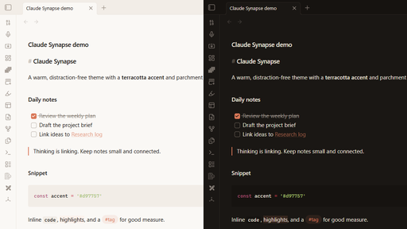

# Claude Synapse

A warm, distraction-free Obsidian theme with a terracotta accent and parchment surfaces, in light and dark variants. It was designed alongside the [Claude Synapse](https://github.com/NunoMotaRicardo/obsidian-synapse) plugin but works in any vault.

## Features

- Warm parchment light mode and warm charcoal dark mode
- Terracotta accent (`#d97757`) across links, checkboxes, and interactive elements
- DM Sans UI font when installed, with a system font fallback
- Compact heading scale
- Full-width editor and reading view

## Installation

In Obsidian, open **Settings → Appearance → Themes → Manage**, search for **Claude Synapse**, then select **Install and use**.

## Credits

The colour token structure (`--bg1`, `--tx1`, `--ax1`, and so on) follows the HSL system from [Minimal](https://github.com/kepano/obsidian-minimal) by kepano and the Optimal theme.

## License

MIT
